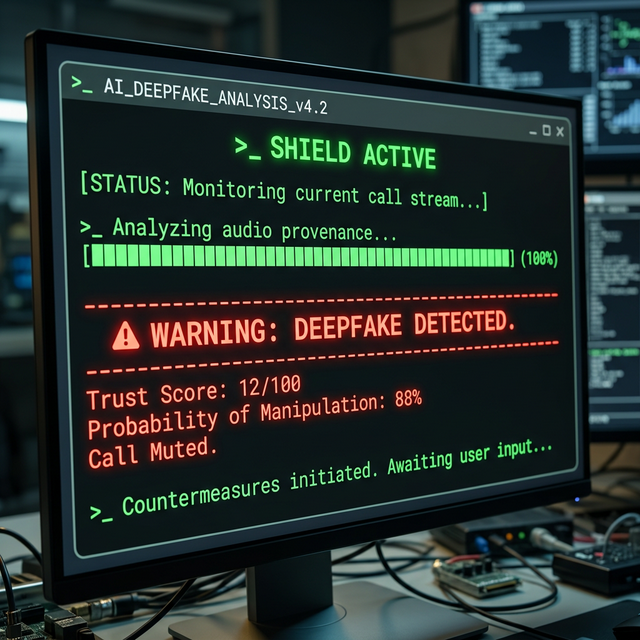

<div align="center">

# 🛡️ Deepfake Cryptographic Shield & Provenance Authenticator



### An OS-Level Guardian Against Synthetic AI Audio & Phishing

[](https://www.python.org/downloads/release/python-3100/)
[](https://opensource.org/licenses/MIT)

</div>

---

## 📖 The Problem We Are Solving

In the age of AI, audio and video deepfakes have made phishing, financial fraud, and geopolitical misinformation nearly indistinguishable from reality. Currently, the burden of determining if a voice call from a "CEO" or a "Family Member" is real rests entirely on the user's ears.

**Deepfake Cryptographic Shield** flips the defense model. It operates constantly as an invisible OS-level "Virtual Audio Interceptor". Instead of relying on human judgment, it forces incoming VoIP (Zoom, WhatsApp) audio through an aggressive checkpoint that combines **Cryptographic Provenance verification** and **Adversarial Machine Learning**.

---

## 🏗️ Core Architecture 

Deepfake Shield is built on a 3-tier defense architecture:

### 1. The Interceptor (`core/audio_interceptor.py`)
Uses OS-level hooks (`PyAudio`) to siphon incoming system audio in 1-second chunks before it ever reaches physical speakers.

### 2. The Cryptographic Provenance Verifier (`core/crypto_verifier.py`)
*The "Passport Check"*. It inspects media streams for C2PA cryptographic watermarks embedded by authentic hardware securely stored in devices like iPhones and high-end webcaws. If a scammer generates audio on a laptop, this cryptographic "passport" is missing, and the call is flagged instantly.

### 3. The Adversarial ML Engine (`core/ml_analyzer.py`)
*The "Lie Detector"*. If a call lacks a verified crypto signature, this is the fallback. Powered by **HuggingFace Transformers (Wav2Vec)**, it slices the raw 16kHz audio stream and scans the mathematical spectrogram for microscopic unnatural frequencies (AI neural vocoder artifacts, missing lung/breath patterns). 

### 4. The Kill Switch (`core/trust_engine.py`)
If the Trust Engine issues a deepfake verdict probability above 75%, it bypasses user interaction and fires a direct OS command (`amixer`/`wpctl`/`pycaw`) to physically mute the system speakers, saving the user from social engineering.

---

## 🚀 QuickStart & Demo

You can clone this repository and spin up a real-time defense simulation locally!

### Prerequisites:
- Python 3.10+
- Linux ALSA (`pyaudio` dependencies) or Windows Equivalents

### 1. Install Dependencies
```bash
python3 -m venv env
source env/bin/activate
pip install -r requirements.txt
```

### 2. Boot the ML Brain (FastAPI Backend)
Start the neural network server that will catch the streamed audio chunks. (Note: On the first run, it will download the ~400MB HuggingFace deepfake classification model `MelodyMachine/Deepfake-audio-detection-V2`).

```bash
uvicorn main:app --reload --port 8001
```

### 3. Run the OS Audio Interceptor
In a separate terminal tab, activate your virtual environment, and run the interceptor. **This will turn your microphone on** to simulate intercepting live audio streams from a VoIP call.

```bash
python core/audio_interceptor.py
```
*Try speaking naturally, and then try playing an ElevenLabs AI audio clip near your microphone to trigger the kill switch!*

### (Optional) 4. Run the Raw Telemetry Demo
If you don't have a working microphone or audio driver, use the programmatic simulator to inject pure mathematical Deepfakes directly into the API:
```bash
python simulate_calls.py
```

---

## 🗺️ Roadmap to v1.0

This repository currently houses the full backend intelligence. The roadmap to a consumer-ready application involves:

- [x] **Phase 1:** Core ML & Cryptographic Engine logic (FastAPI + HuggingFace).
- [x] **Phase 2:** OS-level audio interception prototype (`PyAudio`).
- [ ] **Phase 3:** Full C2PA SDK integration to replace mock PKI logic.
- [ ] **Phase 4:** Build cross-platform Virtual Audio Cable Drivers using C++/Rust.
- [ ] **Phase 5:** Build a sleek system-tray GUI using **Tauri** (React/Rust) to display the real-time "Trust Score" dynamically during calls.

## 🤝 Contributing
Deepfakes are an arms race. If you are an ML researcher, audio engineer, or Rust developer, we need your help building the C2PA parsers and Tauri GUI frontends to make this a ubiquitous utility. Please open an issue or submit a pull request!
# Deepfake-Cryptographic-Shield-provance-Authenticator
